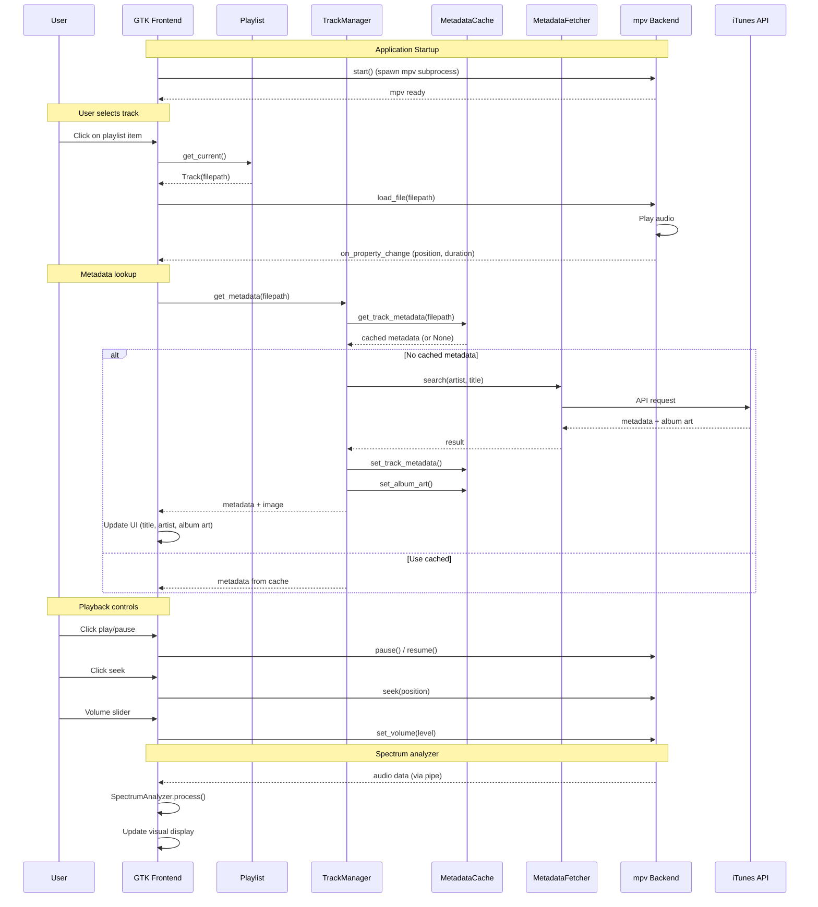

# madOS Audio Player

A Winamp-inspired GTK3 audio player for Linux with mpv backend. Written in Python, it supports playback of common audio formats (MP3, FLAC, OGG, WAV, AAC, OPUS) through mpv/ffmpeg.

## Features

- Winamp-inspired compact UI with Nord theme
- Full playback controls (play, pause, stop, prev, next)
- Seek bar with time display
- Volume control with mute toggle
- Playlist management (add files, folders, remove, clear)
- Shuffle and repeat modes
- Drag and drop support
- File browser integration
- Internationalization support for 6 languages
- mpv backend (supports all common audio formats)
- Audio spectrum analyzer
- Album art fetching from iTunes API
- Metadata caching with SQLite

## Requirements

- Python 3.7+
- mpv (with JSON IPC support)
- GTK 3.0
- Pango + PangoCairo
- GdkPixbuf

## Installation

```bash
# Install dependencies (Ubuntu/Debian)
sudo apt install python3-gi python3-gi-cairo gir1.2-gtk-3.0 gir1.2-pango-1.0 mpv

# Or install via pip (if available)
pip install pygobject mpv
```

## Usage

```bash
# Run the application
python -m mados_audio_player
# or
./mados-audio-player

# Run with files
python -m mados_audio-player /path/to/music/*.mp3
```

## Architecture

### Frontend (GTK3)

The frontend is built with GTK3 and handles:

- **User Interface**: Main window with overlay controls, spectrum analyzer as background
- **Playlist Management**: Track selection, shuffling, repeat modes
- **Album Art Display**: Shows album artwork with caching
- **i18n**: Multi-language support (6 languages)

### Backend (mpv)

The backend uses mpv via JSON IPC socket for:

- Audio playback control (play, pause, stop, seek)
- Volume and mute management
- Track metadata retrieval
- Position/duration tracking
- Support for all audio formats via ffmpeg

### Data Flow



### Module Structure

| Module | Description |
|--------|-------------|
| `app.py` | Main GTK3 application window and UI |
| `backend.py` | mpv JSON IPC backend |
| `playlist.py` | Playlist management and track data |
| `track_manager.py` | Orchestrates metadata fetching/caching |
| `metadata_cache.py` | SQLite cache for track metadata |
| `metadata_fetcher.py` | iTunes API integration |
| `album_art.py` | Album art display management |
| `theme.py` | Nord color theme CSS |
| `spectrum.py` | Audio spectrum analyzer |
| `playlist_window.py` | Separate playlist window |
| `translations.py` | i18n strings |

## Development

### Running Tests

```bash
# Run all tests
python test_flow.py

# Run specific test
python -c "from test_flow import test_metadata_cache; test_metadata_cache()"
python -c "from test_flow import test_track_manager; test_track_manager()"
python -c "from test_flow import test_playback_flow; test_playback_flow()"
```

### Code Style

- Use relative imports for intra-package: `from .module import Class`
- Use absolute imports for stdlib/external: `import os`, `from gi.repository import Gtk`
- Classes: PascalCase (e.g., `AudioPlayerApp`)
- Functions/methods: snake_case (e.g., `get_metadata`)
- Private methods: prefix with underscore (e.g., `_on_update_tick`)
- Constants: SCREAMING_SNAKE_CASE (e.g., `REPEAT_OFF`)

## License

GPL v3